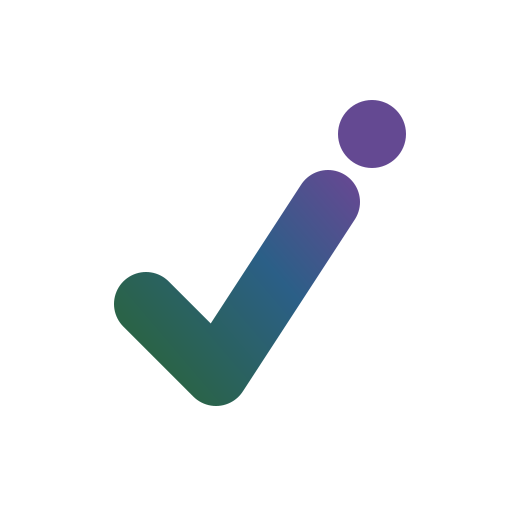
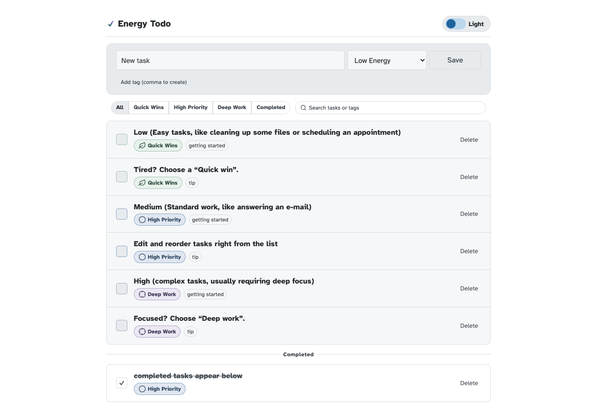
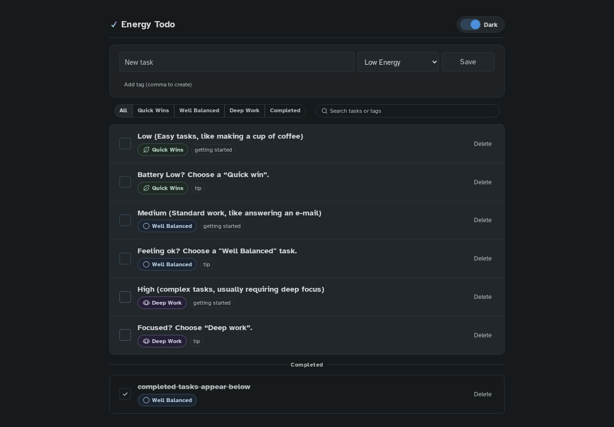

<div align="center" width="100%">
  <picture>
    <source media="(prefers-color-scheme: dark)" srcset="./frontend/public/icons/icon-dark.svg">
    <source media="(prefers-color-scheme: light)" srcset="./frontend/public/icons/icon-light.svg">
    
  </picture>
</div>

# Energy Todo

A self-hosted task manager for neurodiverse and neurospicy brains. Most to-do lists are built around deadlines and priority, but for some folks it’s not about time, it’s about *energy*. Tag tasks by energy cost instead of urgency, then filter your list to match your actual battery: Low battery? Clear a low-energy task for a quick win. Hyperfocused? Settle into a deep work task.

This project was directly inspired by [Executive Function as Code](https://milly.kittycloud.eu/posts/executive-function-as-code-doom-emacs-adhd/) by Milly. 

## Screenshot

| Light mode | Dark mode |
| --- | --- |
|  |  |

*Light and dark mode shown side-by-side.*

## About This Project

I'm Mike, a healthcare provider, researcher, and educator who’s learning to code as a hobby. I built this after struggling to find a minimal, self-hosted task manager that worked with the way my brain organizes energy and attention.

 [Executive Function as Code](https://milly.kittycloud.eu/posts/executive-function-as-code-doom-emacs-adhd/) articulated exactly what I felt I had been missing, and [Blake Watson’s article](https://blakewatson.com/journal/i-used-claude-code-and-gsd-to-build-the-accessibility-tool-ive-always-wanted/) inspired me to follow through and actualy build it myself.

I built this alone, in my limited space time. I'm still learning. Pease be patient with any problems and contribute wherever you can. Pull requests to contribute improvements are welcome and encouraged. 

> [!WARNING]
> I used AI to help build this project. Without it, this tool wouldn’t exist. 
> I used structured prompts, reviewed the output carefully, and treated the process as a way to learn while building something I genuinely needed.

## Accessibility & Design

Built with accessibility and a neurodiversity-affirming experience in mind. It’s still very much a work in progress.

- Designed with WCAG 2.2 AA in mind
- Uses [Atkinson Hyperlegible](https://brailleinstitute.org/freefont) font for readability
- Keyboard-navigable
- Energy-first (not urgency-first) task categorization to reduce analysis paralysis when everything feels “important”
- Calm, minimal interface to reduce the panic spiral when approaching tasks

## Features

- **Energy-based task categorization** — Assign low, medium, or high energy costs to your tasks
- **Tagging** — Easily create additional tags
- **Filter & search** — Filter by energy to match your battery, or search by words or tags
- **Inline editing** — Easily edit a task right from the list. Reorder, add tags, and toggle energy costs. 
- **Light & dark themes** — Easy on the eyes
- **Keyboard accessibility** — Navigate and manage tasks without a mouse
- **Minimal** — It's a minimal todo-list, with simple but (I think) clever functionality to reduce cognitive load
- **Self-hosted** — Run it yourself, your data is yours
- **Docker support** — Get it running quickly
- **Progressive Web App** — Install it on your home screen like a native app on any device

## Installation

### Using Docker (Recommended)

**Prerequisites:** Docker and Docker Compose

1. create a `docker-compose.yaml` file:
   ```yaml   
   services:
     energy-todo:
       container_name: energy-todo
       image: ghcr.io/mgrimace/energy-todo:latest
       ports:
         - "3000:3000"
       volumes:
         - ./energy-data:/app/data:rw
       environment:
         - RUST_LOG=${RUST_LOG:-info}
       user: "${LOCAL_UID:-1000}:${LOCAL_GID:-1000}"
       security_opt:
         - no-new-privileges:true
       cap_drop:
         - ALL
       read_only: true
       tmpfs:
         - /tmp:rw,noexec,nosuid,size=64m
         - /run:rw,noexec,nosuid,size=16m
       restart: unless-stopped
   ```   

2. (Optional) Set up your environment:
  ```bash
  cp .env.example .env
  ```

3. Create the data directory (this matches the `./energy-data:/app/data` volume):
  ```bash
  mkdir -p energy-data
  # If you get permission errors writing to this folder, run:
  sudo chown -R 1000:1000 energy-data
  ```

  > [!TIP]
  > If you changed the container `user:` in `docker-compose.yaml`, update the `1000:1000` above to match the UID/GID you set (via `LOCAL_UID`/`LOCAL_GID`).

4. Start the app:
  ```bash
  docker compose up -d
  ```

5. Open your browser and go to `http://localhost:3000`

Your tasks are saved in the `energy-data/` directory on your machine, so they persist between restarts.

**Install as a PWA:** Once the app is running, look for the install icon in your browser's address bar (or menu) and select "Install app". It will appear on your home screen and work offline.

### Local Development

**Prerequisites:** Node.js, Rust, and Cargo

**Frontend:**
```bash
cd frontend
npm install
npm run dev
```

**Backend:**
```bash
cd backend
cargo run
```

The frontend dev server runs on `http://localhost:5173` and the backend on `http://localhost:8000`.

## Technology Stack

- **Frontend:** React + Vite
- **Backend:** Rust + Actix Web
- **Database:** JSON file (local storage)
- **Containerization:** Docker & Docker Compose

The project is intentionally simple, and it is not designed for enterprise use.

## Support

If you've found this project helpful and would like to support further development, please consider donating. Thank you:
[](https://www.paypal.com/cgi-bin/webscr?cmd=_donations&business=R4QX73RWYB3ZA)
[](https://liberapay.com/cammarata.m/)
[](https://www.ko-fi.com/mgrimace)
[](https://www.buymeacoffee.com/cammaratam)