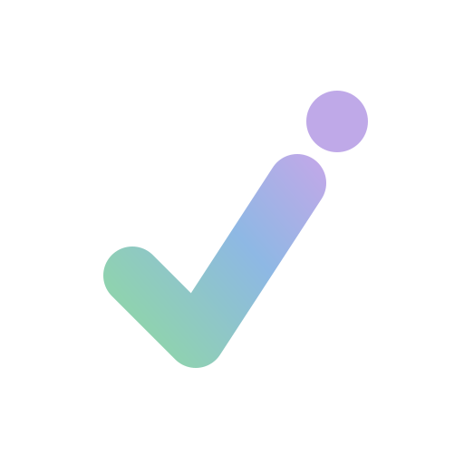
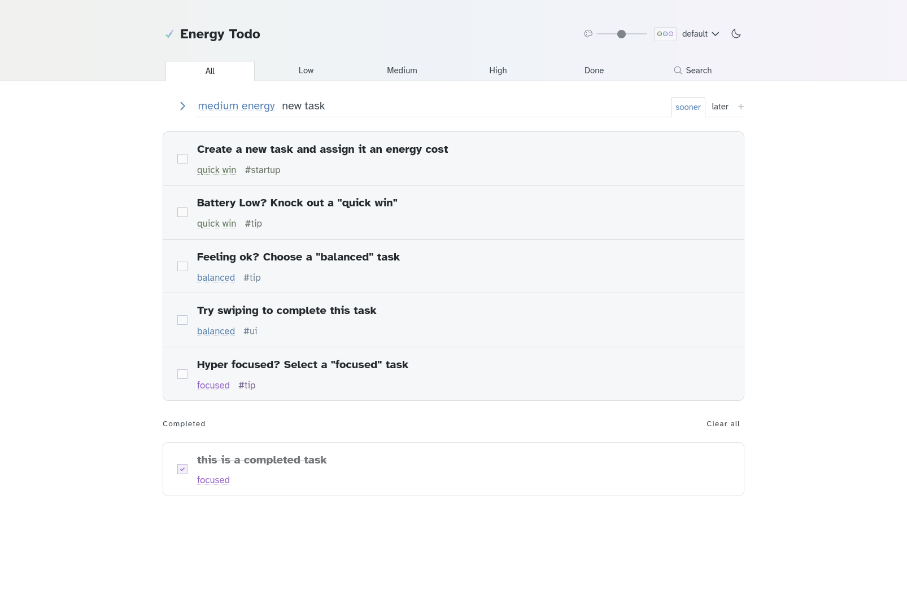
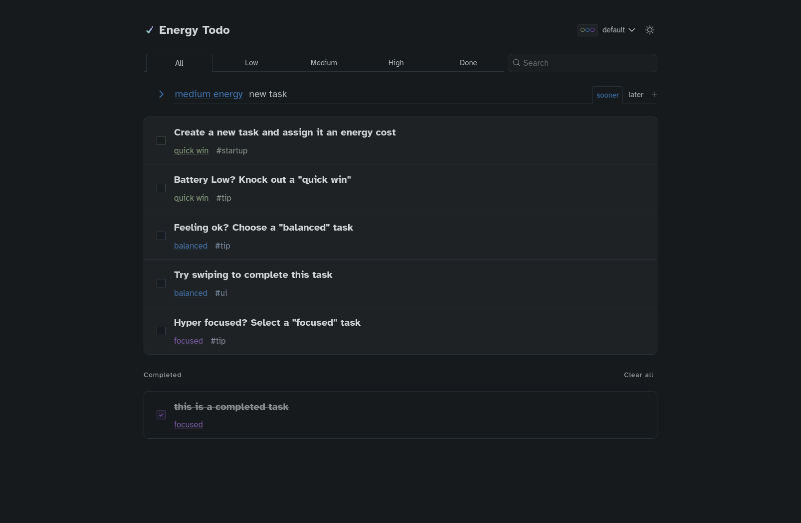
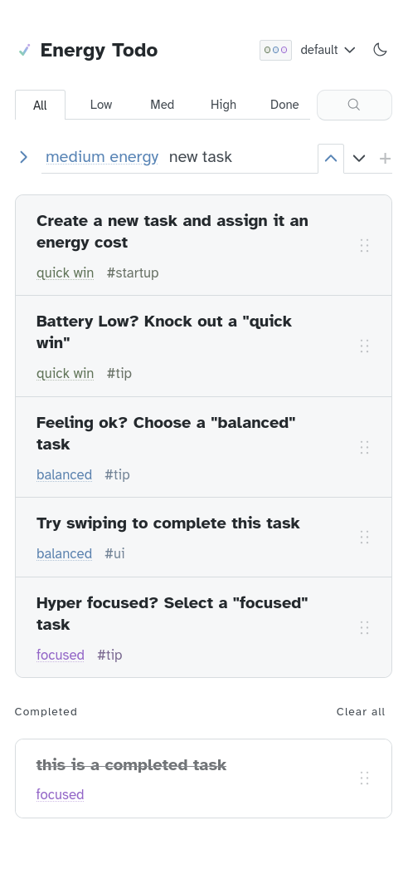
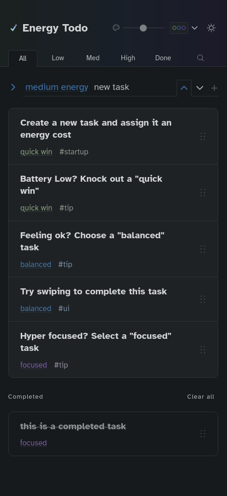

<div align="center" width="100%">
  
</div>

# Energy Todo

A self-hosted task manager for neurodiverse and neurospicy brains. Most to-do lists are built around deadlines and priority, but for some folks it’s not about time, it’s about *energy*. Tag tasks by energy cost instead of urgency, then filter your list to match your actual battery: Low battery? Clear a low-energy task for a quick win. Hyperfocused? Settle into a deep work task.

## Screenshot

<p align="center">
  <a href="./docs/screenshot-light.png"></a>
  <a href="./docs/screenshot-dark.png"></a>
  <a href="./docs/mobile-light.png"></a>
  <a href="./docs/mobile-dark.png"></a>
</p>

> [!TIP]
> Now with themes support: Nord, Everforest, Gruvbox, Solarized, Catppuccin, and more!

## About This Project

I'm Mike, a healthcare provider, researcher, and educator who’s learning to code as a hobby. I built this after struggling to find a minimal, self-hosted task manager that worked with the way my brain organizes energy and attention.

 [Executive Function as Code](https://milly.kittycloud.eu/posts/executive-function-as-code-doom-emacs-adhd/) articulated exactly what I felt I had been missing, and [Blake Watson’s article](https://blakewatson.com/journal/i-used-claude-code-and-gsd-to-build-the-accessibility-tool-ive-always-wanted/) inspired me to follow through and actualy build it myself.

## Features

- **Fast & Lightweight** – ~8 MB RAM use. Fast task entry and instant sync across devices
- **Energy-based task categorization** — Assign low, medium, or high energy costs to your tasks
- **Tagging** — Easily create additional tags
- **Filter & search** — Filter by energy to match your battery, or search by words or tags
- **Inline editing** — Easily edit a task right from the list. Reorder, add tags, and toggle energy costs. 
- **Swipes** - Swipe right to complete, left to delete.
- **Themes with light & dark modes** — A minimal default theme, with Nord, Everforest, Gruvbox, Catppuccin, and more
- **Keyboard accessibility** — Navigate and manage tasks without a mouse
- **Self-hosted** — Run it yourself, your data is yours
- **Docker support** — Get it running quickly
- **Progressive Web App** — Install it on your home screen like a native app on any device
- **Accessibility-first design** — Built to be readable, keyboard-friendly, and reduce cognitive overload (WCAG 2.2 AA–aligned, Atkinson Hyperlegible font).

## Installation

### Using Docker (Recommended)

**Prerequisites:** Docker and Docker Compose

1. Create a `docker-compose.yaml` or copy the [sample compose file](./docker-compose.yml) file:

   ```yaml
   services:
     energy-todo:
       container_name: energy-todo
       image: ghcr.io/mgrimace/energy-todo:latest
       ports:
         - "3000:3000"
       environment:
         - PUID=${PUID:-1000}
         - PGID=${PGID:-1000}
       volumes:
         - ./energy-data:/app/data:rw,z
       restart: unless-stopped
   ```

2. (Optional) Set up your environment:
   ```bash
   cp env.example .env
   ```

   Then set `PUID` and `PGID` in `.env` to your own user and group IDs, so the data folder belongs to you instead of root. Find them with `id -u` and `id -g`. If you skip this, both default to `1000`, which matches most single-user Linux setups.

   ```bash
   PUID=1000
   PGID=1000
   ```

3. Create the data directory (this matches the `./energy-data:/app/data` volume):
   ```bash
   mkdir -p energy-data
   ```

   The container fixes ownership of this folder on startup, so no `chown` is needed.

   > [!TIP]
   > Prefer to run the container as a fixed user instead? Replace the `environment:` block with `user: "1000:1000"` and make sure `energy-data` is owned by that user (create it yourself with `mkdir` first, since Docker creates missing folders as root).

4. Start the app:
   ```bash
   docker compose up -d
   ```

5. Open your browser and go to `http://localhost:3000`

Your tasks are saved in the `energy-data/` directory on your machine, so they persist between restarts.

**Install as a PWA:** Once the app is running, look for the install icon in your browser's address bar (or menu) and select "Install app". It will appear on your home screen and work offline.

### Local Development

**Prerequisites:** Node.js, Rust, and Cargo

**Frontend:**
```bash
cd frontend
npm install
npm run dev
```

**Backend:**
```bash
cd backend
cargo run
```

The frontend dev server runs on `http://localhost:5173` and the backend on `http://localhost:8000`.

## Technology Stack

- **Frontend:** React + Vite
- **Backend:** Rust + Actix Web
- **Database:** SQLite
- **Containerization:** Docker & Docker Compose

The project is intentionally simple, and it is not designed for enterprise use.

## Support

If you've found this project helpful and would like to support further development, please consider donating. Thank you:
[](https://www.paypal.com/cgi-bin/webscr?cmd=_donations&business=R4QX73RWYB3ZA)
[](https://liberapay.com/cammarata.m/)
[](https://www.ko-fi.com/mgrimace)
[](https://www.buymeacoffee.com/cammaratam)